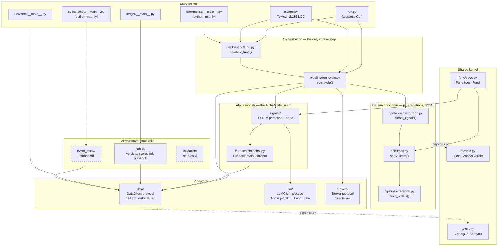

# Architecture

How `aihf` is actually built: the as-built structure, where it drifts from
what the docs claim, and what is worth fixing.

**Audience:** the maintainer and anyone onboarding to the codebase.
**Basis:** full repository access. Recovered 2026-09-20 against `main` @ `dfee2b4`.
**Scope:** full module, runtime, and allocation views, with a health pass alongside.

This is a point-in-time snapshot, not a living spec. Claims are tagged by how
they were established — **Observed** (read in code, with a path), **Inferred**
(follows from observations), or **Unverified** (not checked; §11 says what would
settle it). Where a decision's rationale is not recorded anywhere in the repo,
this document says so rather than inventing one.

---

## 1. Summary

`aihf` is a **modular monolith**: one Python package (`hedge_fund`, 120 files, ~15.8k LOC) with a single deterministic pipeline at its core and pluggable adapters at every edge. It is not a service architecture and has no network surface of its own — it is a CLI plus a Textual TUI over a local library, with all user state in `~/.hedge-fund/`.

The organizing idea is one sentence in `hedge_fund/pipeline/run_cycle.py:2`:

> `point-in-time data -> analysts -> blend -> risk -> execution -> record`

Everything else is a plug into that line. Backtest, one-shot CLI run, and TUI replay are all the *same* `run_cycle` function with a different clock and broker. Three interchangeable seams — `DataClient`, `AlphaModel`, `Broker` (all `typing.Protocol` or ABC) — are what make that true, and each is honored in the code as written.

**This is an unusually disciplined codebase.** The invariants CLAUDE.md claims are real and I verified them in code, not just in docs: the LLM's influence genuinely ends at `Signal`; `blend_signals`, `apply_limits`, and `build_orders` are pure functions with no I/O; the point-in-time discipline is enforced structurally (`FundamentalsSnapshot.content_hash` and `render()` both exclude `as_of`, so identical facts on two dates produce a cache hit rather than two paid LLM calls). Module docstrings carry the *rationale* for decisions, which is rare and is the main reason this analysis could go as deep as it did.

**Top findings**

| # | Finding | Severity |
|---|---|---|
| F1 | The project's own check command fails: 1,071 flake8 errors, 47 files unformatted, isort failures. No CI exists to catch it. | High |
| F2 | Two parallel backtest engines coexist; the older one's docstring says it was to be replaced and it wasn't. | Medium |
| F3 | Sharpe and max-drawdown math is implemented twice — once in the engine, once in the TUI — and can silently diverge. | Medium |
| F4 | Credential bootstrap (`apply_credentials`) lives in `hedge_fund/tui/`, so every non-TUI entry point imports the presentation package. | Low-Medium |
| F5 | `hedge_fund/validation/` is a docstring-only stub; `hedge_fund/event_study/` (1,213 LOC) is reachable but undocumented and unreferenced. | Low |

**Overall risk: low-moderate.** The architecture itself is sound and the seams are in the right places. Every finding is about *erosion at the edges* — tooling, duplication, leftovers — not about the core design. Single-maintainer knowledge concentration is the largest structural risk, and it is mitigated better than usual by the docstrings.

---

## 2. Scope, inputs, and coverage

**Examined in full:** `pyproject.toml`, `README.md`, `CLAUDE.md`, `scripts/weekly.sh`, `scripts/com.aihf.weekly.plist`, and the following modules read end to end — `run.py`, `models.py`, `paths.py`, `pipeline/run_cycle.py`, `pipeline/models.py`, `pipeline/execution.py`, `portfolio/construction.py`, `risk/limits.py`, `fund/spec.py`, `fund/example.yaml`, `signals/base.py`, `signals/__init__.py`, `signals/llm_agent.py`, `features/snapshot.py`, `data/protocol.py`, `data/factory.py`, `llm/cache.py`, `llm/registry.py`, `llm/__init__.py`, `brokers/protocol.py`, `brokers/sim.py`, `ledger/store.py`, `ledger/__main__.py`, `ledger/__init__.py`, `strategies/quality-compounders.yaml`.

**Sampled:** `tui/app.py` (structure map + the metrics and warm-phase regions), `data/cached.py`, `data/edgar.py` (rate limiter and error paths), `llm/client.py`, `llm/anthropic_client.py`, `backtesting/engine.py`, `backtesting/fund.py`.

**Analyzed mechanically:** full AST-derived package import graph across all 120 files; git churn, co-change coupling, and ownership over a 24-month window; the full test suite (`323 passed, 45 skipped`) and all three linters.

**Not examined:** `data/xbrl.py` (430 LOC), `data/free.py`, `data/client.py`, `universe/finviz.py`, `event_study/engine.py`, the 18 individual persona prompt files (structure confirmed via the registry and `base.py`, prompt text not reviewed), and all test bodies.

**Views produced:** module, runtime, allocation. **Omitted:** a formal component view inside `hedge_fund/data`, which would need the XBRL modules read in full.

**Assumptions recorded:** No one was available to answer questions, so at each decision point I chose the reading the code best supports and labeled it. Rationale for decisions is marked "not recorded" wherever no document states it, even where a plausible reason was inferable.

---

## 3. Context and containers


**Legend:** Solid arrow = runtime call, labeled with what flows and over what. Cylinder = persistent state on disk. Everything inside `local` runs in one OS process, except the LaunchAgent which spawns one.

**There is no server, no database, and no deployed component.** Distribution is `pipx install aihf`. The only always-on element is a macOS LaunchAgent that runs a shell script weekly.

### Trust boundaries and secret handling

Five outbound trust boundaries, all egress-only; nothing listens on a port. Credentials live in `~/.hedge-fund/.env`, loaded by `apply_credentials()`, with shell-exported values taking precedence (`README.md`). The SEC's required `User-Agent` is a contact string, not a secret, and `edgar.py:113` refuses to run without it rather than sending a default — the correct choice, since a bad `User-Agent` gets the user's IP blocked for ~10 minutes (`edgar.py:315`).

**Blast radius of a compromised LLM provider is structurally bounded, and this is the single best property of the design.** A malicious or manipulated model response cannot move money in a direction the deterministic layer disallows: its output is validated against `AnalystVerdict` (`llm_agent.py:_parse`), folded into a scalar in `[-1, +1]`, and everything downstream — blending, risk clamps, order construction — is pure arithmetic the model never touches. Risk limits are `extra="forbid"` pydantic models loaded from the mandate, so no prompt can widen them. The worst a hostile response achieves is a wrong-but-in-bounds position in a simulator that places no real trades.

---

## 4. Module view and code map



**Legend:** Solid arrow = imports/calls. Dashed border = orphaned (nothing in the package imports it). Boxes are Python modules; subgraphs are architectural layers, not packages.

### Where things live

| Package | LOC | Role |
|---|---:|---|
| `signals/` | 1,809 | 18 LLM personas + `pead` quant model. Each persona is a name and a system prompt on `LLMAgent`. |
| `data/` | 3,714 | `DataClient` protocol, `free` (EDGAR + yfinance) and `fd` sources, disk cache, XBRL parsing. |
| `tui/` | 2,557 | Textual app + a Textual-free `shared.py` the CLI also imports. |
| `ledger/` | 1,122 | Verdict ledger (append-only JSONL), scorecard, candidate playbook. |
| `llm/` | 1,129 | `LLMClient` protocol, Anthropic SDK client, LangChain fallback, prompt cache. |
| `backtesting/` | 1,164 | `backtest_fund` (fund-level) and `BacktestEngine` (single-model, legacy). |
| `event_study/` | 1,213 | Standalone event-study analysis. Orphaned. |
| `pipeline/` | 692 | `run_cycle` + the pure execution stage + `CycleRecord`. |
| `universe/` | 593 | Finviz screen → ticker list, with an EDGAR-servability filter. |
| `fund/` | 396 | `FundSpec`/`Fund` — the mandate as data. |
| `features/` | 341 | The point-in-time `FundamentalsSnapshot`. |
| `portfolio/`, `risk/`, `brokers/` | 418 | The pure core plus the broker seam. |
| `validation/` | 5 | Docstring-only stub. |

### Dependency graph health

The package graph is **acyclic at the intended layers**. The pure core (`portfolio`, `risk`, `pipeline/execution`) imports only `models.py` and pydantic — no data, LLM, or broker imports, which is exactly what CLAUDE.md claims. `data/` and `llm/` depend only on the root shared kernel. No module imports a concrete provider where a protocol exists.

The one structural wrinkle is the `tui` package, discussed as F4 — `backtesting`, `event_study`, `ledger`, and `universe` all import from it. Notably, `run.py` imports `tui.shared` at module level but defers `tui.app` to inside the `if args.mandate is None` branch (`run.py:127`), so the non-interactive path never loads Textual. That is a deliberate, correctly-implemented optimization and `shared.py`'s docstring states the intent.

---

## 5. Key runtime scenarios

### 5.1 One fund cycle (`aihf <mandate> --tickers AAPL,MSFT`)

```mermaid
sequenceDiagram
    participant U as User
    participant CLI as run.py
    participant F as Fund (fund/spec.py)
    participant RC as run_cycle
    participant D as CachedDataClient
    participant A as LLMAgent x N
    participant PC as PromptCache
    participant API as Anthropic API
    participant P as blend → risk → orders
    participant B as SimBroker

    U->>CLI: mandate + --tickers
    CLI->>CLI: apply_credentials(), validate source can staff every model
    Note over CLI: fails BEFORE any network call if a model is unservable
    CLI->>F: Fund(spec) — instantiate staff ONCE (caches survive cycles)
    CLI->>RC: run_cycle(fund, as_of, broker, data, universe)
    RC->>D: get_prices() per ticker (7-day lookback)
    D-->>RC: marks; unpriced+unheld → TickerSkip, unpriced+HELD → raise
    loop per strategy, then (ticker x analyst) over a 4-thread pool
        RC->>A: predict(ticker, as_of, data)
        A->>D: get_financial_metrics(filed <= as_of)
        A->>A: build_snapshot() → content_hash (excludes as_of)
        A->>PC: get(prompt_key)
        alt cache hit
            PC-->>A: stored verdict ($0)
        else miss
            A->>API: complete(system, user) w/ JSON schema + cache breakpoint
            API-->>A: verdict | refusal | error
            A->>PC: put() — prompt AND response, atomically
        end
        A-->>RC: Signal(value in [-1,1]) or abstain(value=0)
    end
    Note over RC,P: LLM influence ENDS HERE. Everything below is pure.
    RC->>P: blend_signals() → apply_limits() → build_orders()
    P-->>RC: orders (sells first, then buys, alphabetical)
    RC->>B: place_order() each
    RC-->>CLI: CycleRecord (fully serialized, round-trips)
    CLI->>U: JSON on stdout, human summary on stderr
```

Three details make this work as designed, all verified in code:

- **Determinism.** Given the same spec, date, broker state, and data, the record is byte-identical. The thread pool reassembles results into submission order (`run_cycle.py:_predict_all`), so `HEDGE_FUND_LLM_WORKERS=1` produces exactly the same record as `=4`. Exceptions propagate as the serial loop would raise them, and remaining futures are cancelled rather than left to spend money.
- **Concurrency safety.** `CachedDataClient` writes non-atomically (`data/cached.py:131` — plain `write_text`) and `FDClient` owns one `requests.Session`, so the fan-out wraps the client in `_SerializedDataClient`, a lock-per-call proxy. I verified the non-atomic write the comment cites; the reasoning is accurate. `PromptCache`, by contrast, *is* atomic (mkstemp + `os.replace`), because parallel analysts can produce the same key simultaneously.
- **Failure contract.** Exactly as CLAUDE.md states: `InsufficientData` → abstain; LLM call, parse, or refusal failure → abstain with the raw response persisted for debugging; any other data-layer exception → propagates. An abstention is excluded from *both* sides of the blend average, so "no opinion" never masquerades as "opinion: neutral" (`construction.py`).

### 5.2 The weekly loop (`scripts/weekly.sh`, via LaunchAgent)

Re-select quality and value universes from a live Finviz screen → run three desks at low effort → ingest verdicts into the JSONL ledger → print candidates and the 63-day scorecard → tally cost from INFO log lines → report names whose verdicts trail a newer filing.

The economics here are the point, and they follow from the snapshot hash. A verdict's identity is `(school, ticker, snapshot_hash)`, and the snapshot excludes `as_of` — so **in a week with no new filings, every call is a cache hit, the run costs $0, and the ledger adds zero rows.** The script fails closed on an empty or throttled screen (`weekly.sh:26-27`) rather than passing an empty universe to `aihf`.

---

## 6. Deployment and ownership

**Deployment** is a PyPI package installed with `pipx`. The package directory stays read-only; all mutable state is under `~/.hedge-fund/` (`paths.py`), so a `pipx` install and a git checkout behave identically. The example mandate ships inside the package and is *copied out* on first use rather than read in place.

**Ownership is fully concentrated.** Over the last 24 months the repo has 928 commits from ~30 contributors, but the current `hedge_fund/` package is 17 commits from one author and 6 from another. Nine of the sixteen subpackages have a single contributor and a top-share of 1.00. There is no CODEOWNERS file and no CI.

This is normal for a personal research project and I am not flagging it as a defect. What it does mean: the docstrings are the only continuity mechanism, and they are unusually good — `run_cycle.py`, `construction.py`, `limits.py`, and `snapshot.py` each explain *why*, including accepted warts. Preserving that habit matters more here than in a team codebase.

**Conway's-law note.** With one maintainer there is no organizational seam for the module boundaries to disagree with, which is likely *why* the boundaries are as clean as they are. The corresponding risk is that the boundaries hold by the author's discipline rather than by any automated enforcement — which is what F1 is really about.

---

## 7. Documented versus actual

| # | Claim | Source | Verdict | Evidence |
|---|---|---|---|---|
| 1 | LLM influence ends at `Signal`; blend/limits/orders are pure and deterministic | CLAUDE.md | **Holds** | `construction.py`, `limits.py`, `execution.py` have no I/O and import only `models.py` + pydantic. |
| 2 | Point-in-time discipline; `render()` is date-free on purpose | CLAUDE.md | **Holds** | `snapshot.py`: both `content_hash` and `render()` exclude `as_of`; `build_snapshot` avoids `get_market_cap` explicitly to prevent lookahead. |
| 3 | Data errors propagate; LLM errors abstain | CLAUDE.md | **Holds** | `llm_agent.py:predict` — `InsufficientData` → abstain, `LLMRefusal`/`Exception` → abstain, everything else propagates. |
| 4 | Anthropic via SDK, others via LangChain | CLAUDE.md, README | **Holds** | `llm/client.py:make_llm` routes `claude-*` to `AnthropicLLM`, everything else to `ChatLLM`. |
| 5 | Every EDGAR call goes through a shared rate limiter | CLAUDE.md | **Holds** | `edgar.py:87` — module-level `_LIMITER` singleton, thread-safe, "one per process: the SEC counts per IP". |
| 6 | Methods a source cannot serve raise `NotImplementedError` | CLAUDE.md | **Holds** | Stated in `data/protocol.py` contract; `factory.py` blocks `pead` on `free` at CLI-parse time, before any network call. |
| 7 | Tests live next to the code as `test_*.py`; fakes, no network | CLAUDE.md | **Holds** | 40 test files co-located; 323 pass in 6.35s, which is only possible without network. |
| 8 | Personas are schools with a scope note and a common hard-rules tail | CLAUDE.md, README | **UNVERIFIED** | Registry and `base.py` confirm the *structure* (a persona is a name + a system prompt). The 18 prompt bodies were **not read**, so whether each carries the common hard-rules tail from `buffett.py` is unestablished — neither confirmed nor contradicted. See Q6 in §11. |
| 9 | "poetry run pytest && black --check && isort --check-only && flake8" is the check | CLAUDE.md | **VIOLATED** | pytest passes; the other three fail. See F1. |
| 10 | "Week 8 portfolio construction will replace this harness" | `backtesting/engine.py:11` | **VIOLATED** | Portfolio construction exists and `backtest_fund` ships, but `BacktestEngine` was never removed. See F2. |
| 11 | TUI Sharpe is "same math as run.py `_BacktestBoard._render`" | `tui/app.py:1972` | **Stale** | No `_BacktestBoard` exists anywhere in the repo. See F3. |
| 12 | "v2 validation framework: CPCV, PBO" | `validation/__init__.py` | **Drift** | The package is 5 lines of docstring and no code. See F5. |
| 13 | README documents the CLIs | README | **Partial** | `aihf`, `aihf-universe`, `aihf-ledger` documented. `python -m hedge_fund.backtesting` and `python -m hedge_fund.event_study` exist and are documented nowhere. |

### Note on the repository's history

The git history carries a **fully deleted predecessor architecture**: a React frontend (`app/frontend`, 303 commits, 29.5k lines changed), a backend (`app/backend`), LangGraph agents (`src/agents`, 133 commits), and Docker config. All of it was removed in `a7a99e5 "Make 2.0.0 the default"`. The current package was built as `v2/` and later renamed `hedge_fund/`.

This matters for two reasons. First, the churn table is dominated by code that no longer exists, so history-based tooling will mislead anyone who runs it without this context. Second, **the current architecture is a deliberate ground-up replacement, not an evolution** — which explains why the boundaries are so clean, and why the leftovers in F2 and F5 stand out as the few pieces that survived the rewrite without a job.

---

## 8. Quality-attribute assessment

**Cost efficiency** — *the dominant quality attribute, and the one the architecture is most explicitly shaped around.*
> Scenario: the maintainer re-runs the weekly loop over ~20 tickers x ~6 schools in a week where no company filed. Response: zero LLM calls, zero dollars, zero new ledger rows.

Met, by construction. Three mechanisms compose: the snapshot hash excludes `as_of`; `PromptCache` keys on exact prompt text; the ledger keys on `(school, ticker, snapshot_hash)`. **Sensitivity point:** any change that puts a date, a timestamp, or a float formatted differently into `render()` breaks all three at once and turns a free run into a full-price one. This is the highest-leverage invariant in the system and nothing currently guards it. (See R3.)

**Determinism / reproducibility**
> Scenario: the same mandate, date, and warm cache are run twice. Response: byte-identical `CycleRecord`.

Met. Verified in `run_cycle` (order-preserving fan-out), `SimBroker` (fills exactly at the reference price), and `build_orders` (sorted, sells-then-buys). **Trade-off point:** `SimBroker` models no slippage, costs, or margin, and says so in its docstring. Determinism was chosen over realism deliberately; backtest returns are therefore optimistic and the code is honest about it.

**Correctness of financial reasoning**
> Scenario: a model returns a malformed, hostile, or refused response. Response: the agent abstains; the book is unaffected beyond one missing vote.

Met. Single validation point (`AnalystVerdict` in `_parse`), applied to every provider including Anthropic, where the API already enforces the schema — belt and braces, correctly chosen since a LangChain provider gets no such guarantee.

**Modifiability**
> Scenario: add a new data source, LLM provider, broker, or persona. Response: one new file, one registry entry, no changes to the pipeline.

Met for all four. A persona is genuinely a name plus a system prompt. **Risk:** F3's duplicated metric math is the one place where a single change must be made twice.

**Testability**
> Scenario: the full suite runs offline in CI. Response: 323 pass, 45 skip, 6.35s.

Met for the core. **Gap:** `hedge_fund/tui/` is 2,557 LOC against an 11-line test file that covers `shared.py` only — `app.py`, including the duplicated metric math in F3, is untested.

**Security**
Assessed in §3. Egress-only, no listeners, no credentials in code, secrets in `~/.hedge-fund/.env` with shell precedence. The educational-only constraint is honored architecturally, not just in the README: `SimBroker` is the only `Broker` implementation and no brokerage credential path exists anywhere in the package.

**Non-risks worth stating:** availability, scalability, and multi-tenancy do not apply — this is single-user, single-process, local software, and treating any of them as a concern would be wasted work.

---

## 9. Recovered decisions

Five ADRs are worth recording. Full text in the companion file; summarized here.

**ADR-R001 — Protocol-based seams over inheritance.** `DataClient`, `Broker`, and `LLMClient` are all `runtime_checkable` `typing.Protocol`. *Rationale: partially recorded* — `data/protocol.py` says "no inheritance required; Python's structural typing handles the rest," and `brokers/protocol.py` says it "mirrors the DataClient pattern." Whether ABCs were considered and rejected is not recorded. Note the deliberate asymmetry: `AlphaModel` is an ABC, not a Protocol, because it carries shared numeric helpers in `QuantModel`.

**ADR-R002 — The prompt cache is simultaneously cache, audit record, and debug trail.** *Rationale: recorded*, and marked "a locked design decision" in `llm/cache.py`. Consequence: cache entries can never be evicted on size, since eviction would destroy the audit trail.

**ADR-R003 — Mandates are ticker-free.** A `FundSpec` is the desk; the universe is a run-time argument. *Rationale: recorded* in `fund/spec.py` — "exactly as a real fund's mandate outlives any particular position." `load_spec` strips a legacy `universe` key so older saved funds still load against `extra="forbid"`.

**ADR-R004 — `run_cycle` is the single code path for backtest, paper, and live.** *Rationale: recorded* — "only the clock and the broker change; the pipeline never does."

**ADR-R005 — Anthropic bypasses LangChain.** *Rationale: recorded* in `llm/client.py` — LangChain's forced-tool structured-output mode breaks on Anthropic reasoning models. Consequence: two client code paths, and effort/prompt-caching features exist only on the Anthropic path.

**Questions only the maintainer can answer:** Was `hedge_fund/validation/` (CPCV, PBO) abandoned or deferred? Is `event_study/` still wanted? Was `BacktestEngine` kept intentionally for single-model research, or simply not deleted?

---

## 10. Recommendations

Ranked by impact against the strength of evidence, weighed against effort.

### R1 — Restore the check command and put it in CI (effort: M) — addresses F1

`poetry run pytest hedge_fund && black --check && isort --check-only && flake8` is CLAUDE.md's stated gate, and three of its four legs currently fail:

| Tool | Result |
|---|---|
| pytest | 323 passed, 45 skipped |
| black --check | 47 files would be reformatted (31 prod, 16 test) |
| isort --check-only | multiple failures |
| flake8 | **1,071 errors** — 1,057 `E501`, 10 `E203`, 2 `F401`, 1 `F841`, 1 `E127` |

Almost all of this is one configuration bug, not 1,071 real problems: `pyproject.toml` sets `line-length = 420` for black, but there is **no `.flake8`, `setup.cfg`, or `tox.ini`**, so flake8 uses its 79-character default. The two tools are configured to disagree by 341 characters. `E203` is the well-known black/flake8 slice-colon conflict.

Do this in order:
1. Add a `.flake8` with `max-line-length = 420` and `extend-ignore = E203`. That should clear ~1,067 of the 1,071.
2. Fix the genuine residue — 2 unused imports (`F401`), 1 unused local (`F841`), 1 continuation-line issue (`E127`).
3. Run `black` and `isort` once across the package to absorb the formatting drift in a single mechanical commit.
4. Add `.github/workflows/check.yml` running all four legs. **There is currently no CI at all** — `.github/` contains only issue templates — which is why this drifted unnoticed and why every fitness function below has nowhere to run until this lands.

**Fitness function:** the four-legged check as a required CI job on push and PR.

### R2 — Guard the pure core against I/O imports (effort: S) — protects the central invariant

CLAUDE.md's most important rule — "blend_signals, apply_limits, and build_orders are pure and deterministic; never move sizing or ordering into a prompt" — currently holds only by discipline. Make it mechanical:

```python
# hedge_fund/pipeline/test_purity.py
FORBIDDEN = ("hedge_fund.data", "hedge_fund.llm", "hedge_fund.brokers",
             "hedge_fund.signals", "requests", "anthropic", "yfinance")

def test_pure_core_imports_no_io():
    """The LLM's influence ends at Signal. Enforced, not just documented."""
    for mod in ("hedge_fund/portfolio/construction.py",
                "hedge_fund/risk/limits.py",
                "hedge_fund/pipeline/execution.py"):
        tree = ast.parse(Path(mod).read_text())
        for node in ast.walk(tree):
            names = ([a.name for a in node.names] if isinstance(node, ast.Import)
                     else [node.module or ""] if isinstance(node, ast.ImportFrom)
                     else [])
            for name in names:
                assert not name.startswith(FORBIDDEN), f"{mod} imports {name}"
```

**Fitness function:** that test, in the suite. It fails the moment anyone routes sizing through a prompt.

### R3 — Pin the snapshot-render contract with a golden test (effort: S) — protects the cost model

The entire cost story rests on `render()` and `content_hash` being date-free and byte-stable. Add a test that builds a snapshot from fixed fake metrics and asserts (a) `render()` matches a checked-in golden string exactly, and (b) the same fundamentals at two different `as_of` dates produce the same `content_hash`. A one-character formatting change to `_fmt` currently invalidates every cached verdict silently and turns the next weekly run from free into full-price.

**Fitness function:** the golden test. A deliberate prompt change updates the golden file in the same commit, which makes the cost consequence explicit in review.

### R4 — Extract the metrics math into one function (effort: S) — addresses F3

`backtesting/fund.py:_metrics` computes Sharpe and max drawdown with numpy (`ddof=1`); `tui/app.py:1970-1999` recomputes both with `statistics.stdev` and `math.sqrt`. The TUI already imports `_PERIODS_PER_YEAR` from the engine — a private name crossing a package boundary — which shows the coupling is known. The two agree today (both use sample stdev, both prepend `capital` to the curve), but nothing keeps them in step, and the TUI copy is untested. The comment pointing at `run.py:_BacktestBoard._render` refers to a symbol that no longer exists anywhere in the repo.

Export a public `running_metrics(capital, nav, cadence) -> (sharpe, max_dd)` from `backtesting/fund.py`, call it from both, and delete the stale comment.

**Fitness function:** a test asserting the engine's final `sharpe_ratio`/`max_drawdown_pct` equal the incremental computation over the same NAV series.

### R5 — Resolve the leftovers (effort: S) — addresses F2 and F5

Three decisions, each needing only a yes or no:
- **`hedge_fund/validation/`** — 5 lines of docstring promising CPCV and PBO, no code. Delete it or open an issue; a package that advertises a validation framework it does not have is worse than no package.
- **`hedge_fund/event_study/`** — 1,213 LOC with tests and a working `python -m` entry point, imported by nothing and mentioned in no doc. If it is a live research tool, give it a README section and a console script; if not, delete it.
- **`BacktestEngine`** — its own docstring says portfolio construction would replace it. It survives only as `backtesting/__main__.py`'s engine. Either state in the docstring that it is intentionally retained for single-model research and remove the stale promise, or delete it with its `__main__`.

**Fitness function:** a test asserting every non-`__init__` module under `hedge_fund/` is either imported by another module, referenced by a `pyproject.toml` script, or listed in an explicit `STANDALONE_TOOLS` allowlist. New orphans then fail the build.

### R6 — Move `apply_credentials` out of `tui` (effort: S) — addresses F4

`tui/keys.py:apply_credentials` is credential bootstrap, not presentation, and `run.py`, `ledger/__main__.py`, `universe/__main__.py`, `event_study/__main__.py`, and `backtesting/__main__.py` all reach into the TUI package to get it. Move it to `hedge_fund/credentials.py` beside `paths.py` and re-export from `tui.keys` for compatibility. `tui/shared.py` is genuinely shared presentation and should stay where it is — its docstring already explains why.

**Fitness function:** extend R2's import test so no module outside `hedge_fund/tui/` imports `hedge_fund.tui.keys`.

---

## 11. Open questions

1. Is `hedge_fund/validation/` (CPCV, PBO) deferred or abandoned?
2. Is `event_study/` still in use? Nothing imports it and no doc mentions it.
3. Was `BacktestEngine` kept deliberately for single-model research, or just not deleted in the rewrite?
4. Should `python -m hedge_fund.backtesting` and `python -m hedge_fund.event_study` become console scripts, or are they private dev tools?
5. Was the flake8/black line-length mismatch a known trade-off, or has the check simply not been run recently?
6. **(Unverified — drift-table row 8.)** Do all 18 persona prompts actually carry
   the common hard-rules tail from `buffett.py` that CLAUDE.md mandates? The
   structural pattern is confirmed; the prompt bodies were not read. This is the
   invariant that keeps a persona a *school applying a documented framework*
   rather than an impersonation, so it is the one open question with a
   correctness consequence rather than a housekeeping one.
   *Settled by:* reading all 18 prompt bodies and adding a test that asserts the
   tail is present in every entry of `ALPHA_MODEL_REGISTRY`.
