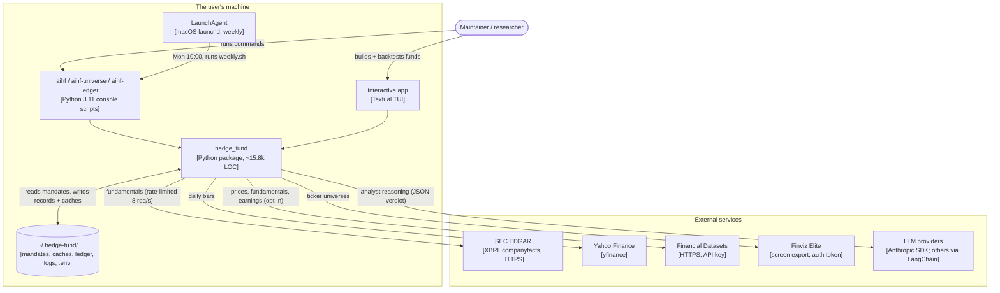
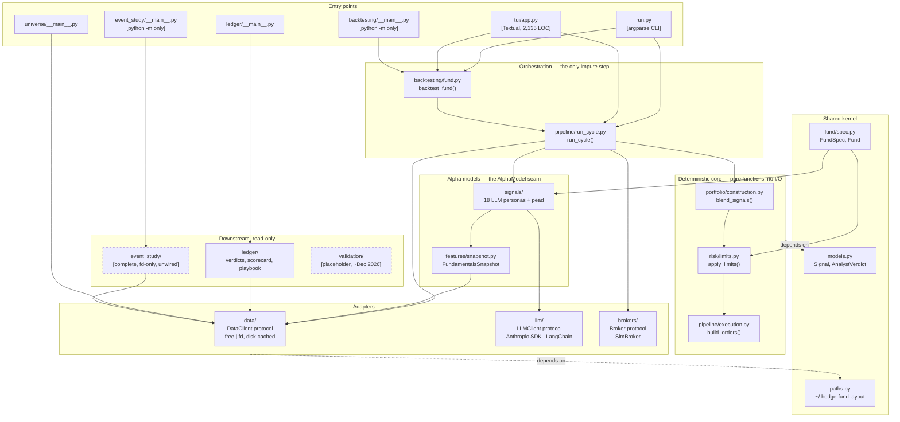

# Architecture

How `aihf` is actually built: the as-built structure, where it drifts from
what the docs claim, and what is worth fixing.

**Audience:** the maintainer and anyone onboarding to the codebase.
**Basis:** full repository access. Recovered 2026-09-20 against `main` @ `dfee2b4`.
**Scope:** full module, runtime, and allocation views, with a health pass alongside.

> **Resolved on branch `architecture-docs-and-tooling` (Sept 2026).** F1, F3
> and F4 are fixed; F2 and F5 were examined and deliberately closed as
> "keep". The findings table, the drift table and §10 below are kept as
> written, with each row marked, because the reasoning is why the fixes
> look the way they do. §12 records what changed.

This is a point-in-time snapshot, not a living spec. Claims are tagged by how
they were established — **Observed** (read in code, with a path), **Inferred**
(follows from observations), or **Unverified** (not checked; §11 says what would
settle it). Where a decision's rationale is not recorded anywhere in the repo,
this document says so rather than inventing one.

---

## 1. Summary

`aihf` is a **modular monolith**: one Python package (`hedge_fund`, 120 files, ~15.8k LOC) with a single deterministic pipeline at its core and pluggable adapters at every edge. It is not a service architecture and has no network surface of its own — it is a CLI plus a Textual TUI over a local library, with all user state in `~/.hedge-fund/`.

The organizing idea is one sentence in `hedge_fund/pipeline/run_cycle.py:2`:

> `point-in-time data -> analysts -> blend -> risk -> execution -> record`

Everything else is a plug into that line. Backtest, one-shot CLI run, and TUI replay are all the *same* `run_cycle` function with a different clock and broker. Three interchangeable seams — `DataClient`, `AlphaModel`, `Broker` (all `typing.Protocol` or ABC) — are what make that true, and each is honored in the code as written.

**This is an unusually disciplined codebase.** The invariants CLAUDE.md claims are real and I verified them in code, not just in docs: the LLM's influence genuinely ends at `Signal`; `blend_signals`, `apply_limits`, and `build_orders` are pure functions with no I/O; the point-in-time discipline is enforced structurally (`FundamentalsSnapshot.content_hash` and `render()` both exclude `as_of`, so identical facts on two dates produce a cache hit rather than two paid LLM calls). Module docstrings carry the *rationale* for decisions, which is rare and is the main reason this analysis could go as deep as it did.

**Top findings**

| # | Finding | Severity |
|---|---|---|
| F1 | ~~The project's own check command fails: 1,071 flake8 errors, 47 files unformatted, isort failures. No CI exists to catch it.~~ **Fixed.** All four legs green and enforced in CI. See §12. | High |
| F2 | ~~Two parallel backtest engines coexist; the older one's docstring says it was to be replaced and it wasn't.~~ **Closed — kept.** The docstring was false, not the code. Both engines answer different questions; only the stale promise was removed. See §12. | Medium |
| F3 | ~~Sharpe and max-drawdown math is implemented twice — once in the engine, once in the TUI — and can silently diverge.~~ **Fixed.** One implementation, `backtesting.running_metrics`. See §12. | Medium |
| F4 | ~~Credential bootstrap (`apply_credentials`) lives in `hedge_fund/tui/`, so every non-TUI entry point imports the presentation package.~~ **Fixed.** Moved to `hedge_fund/config/`. See §12. | Low-Medium |
| F5 | ~~`hedge_fund/validation/` is a docstring-only stub; `hedge_fund/event_study/` (1,213 LOC) is reachable but undocumented and unreferenced.~~ **Closed — both kept, status documented.** `event_study`'s library is complete, not abandoned; my first read of it was wrong. See §12. | Low |

**Overall risk: low-moderate as first assessed; low after the fixes in §12.** The architecture itself is sound and the seams are in the right places. Every finding was about *erosion at the edges* — tooling, duplication, leftovers — not about the core design, and the invariants that matter are now enforced by tests rather than by discipline. Single-maintainer knowledge concentration remains the largest structural risk, mitigated better than usual by the docstrings. The one open operational gap is coverage, not correctness: nine of eighteen schools run weekly, and the scorecard will rank those nine and stay silent about the rest (§12).

---

## 2. Scope, inputs, and coverage

**Examined in full:** `pyproject.toml`, `README.md`, `CLAUDE.md`, `scripts/weekly.sh`, `scripts/com.aihf.weekly.plist`, and the following modules read end to end — `run.py`, `models.py`, `paths.py`, `pipeline/run_cycle.py`, `pipeline/models.py`, `pipeline/execution.py`, `portfolio/construction.py`, `risk/limits.py`, `fund/spec.py`, `fund/example.yaml`, `signals/base.py`, `signals/__init__.py`, `signals/llm_agent.py`, `features/snapshot.py`, `data/protocol.py`, `data/factory.py`, `llm/cache.py`, `llm/registry.py`, `llm/__init__.py`, `brokers/protocol.py`, `brokers/sim.py`, `ledger/store.py`, `ledger/__main__.py`, `ledger/__init__.py`, `strategies/quality-compounders.yaml`.

**Sampled:** `tui/app.py` (structure map + the metrics and warm-phase regions), `data/cached.py`, `data/edgar.py` (rate limiter and error paths), `llm/client.py`, `llm/anthropic_client.py`, `backtesting/engine.py`, `backtesting/fund.py`.

**Analyzed mechanically:** full AST-derived package import graph across all 120 files; git churn, co-change coupling, and ownership over a 24-month window; the full test suite (`323 passed, 45 skipped`) and all three linters.

**Not examined:** `data/xbrl.py` (430 LOC), `data/free.py`, `data/client.py`, `universe/finviz.py`, `event_study/engine.py`, the 18 individual persona prompt files (structure confirmed via the registry and `base.py`, prompt text not reviewed), and all test bodies.

**Views produced:** module, runtime, allocation. **Omitted:** a formal component view inside `hedge_fund/data`, which would need the XBRL modules read in full.

**Assumptions recorded:** No one was available to answer questions, so at each decision point I chose the reading the code best supports and labeled it. Rationale for decisions is marked "not recorded" wherever no document states it, even where a plausible reason was inferable.

---

## 3. Context and containers



**Legend:** Solid arrow = runtime call, labeled with what flows and over what. Cylinder = persistent state on disk. Everything inside `local` runs in one OS process, except the LaunchAgent which spawns one.

**There is no server, no database, and no deployed component.** Distribution is `pipx install aihf`. The only always-on element is a macOS LaunchAgent that runs a shell script weekly.

### Trust boundaries and secret handling

Five outbound trust boundaries, all egress-only; nothing listens on a port. Credentials live in `~/.hedge-fund/.env`, loaded by `apply_credentials()`, with shell-exported values taking precedence (`README.md`). The SEC's required `User-Agent` is a contact string, not a secret, and `edgar.py:113` refuses to run without it rather than sending a default — the correct choice, since a bad `User-Agent` gets the user's IP blocked for ~10 minutes (`edgar.py:315`).

**Blast radius of a compromised LLM provider is structurally bounded, and this is the single best property of the design.** A malicious or manipulated model response cannot move money in a direction the deterministic layer disallows: its output is validated against `AnalystVerdict` (`llm_agent.py:_parse`), folded into a scalar in `[-1, +1]`, and everything downstream — blending, risk clamps, order construction — is pure arithmetic the model never touches. Risk limits are `extra="forbid"` pydantic models loaded from the mandate, so no prompt can widen them. The worst a hostile response achieves is a wrong-but-in-bounds position in a simulator that places no real trades.

---

## 4. Module view and code map



**Legend:** Solid arrow = imports/calls. Dashed border = orphaned (nothing in the package imports it). Boxes are Python modules; subgraphs are architectural layers, not packages.

### Where things live

| Package | LOC | Role |
|---|---:|---|
| `signals/` | 1,809 | 18 LLM personas + `pead` quant model. Each persona is a name and a system prompt on `LLMAgent`. |
| `data/` | 3,714 | `DataClient` protocol, `free` (EDGAR + yfinance) and `fd` sources, disk cache, XBRL parsing. |
| `tui/` | 2,557 | Textual app + a Textual-free `shared.py` the CLI also imports. |
| `ledger/` | 1,400 | Verdict ledger (append-only JSONL), scorecard with per-school coverage states, candidate playbook. |
| `llm/` | 1,129 | `LLMClient` protocol, Anthropic SDK client, LangChain fallback, prompt cache. |
| `backtesting/` | 1,164 | `backtest_fund` (fund-level) and `BacktestEngine` (single-model alpha isolation — retained deliberately, not legacy). |
| `event_study/` | 1,213 | Earnings CARs, market model, bootstrap CIs. **Library complete; requires `--data fd`; unwired on purpose.** Its `__main__` demo has drifted from it. |
| `pipeline/` | 692 | `run_cycle` + the pure execution stage + `CycleRecord`. |
| `universe/` | 593 | Finviz screen → ticker list, with an EDGAR-servability filter. |
| `fund/` | 396 | `FundSpec`/`Fund` — the mandate as data. |
| `features/` | 341 | The point-in-time `FundamentalsSnapshot`. |
| `portfolio/`, `risk/`, `brokers/` | 418 | The pure core plus the broker seam. |
| `config/`, `roster.py` | 180 | Credentials (out of `tui/`) and the import-light school roster with blocked annotations. |
| `validation/` | 5 | Dated placeholder for CPCV/PBO. Deferred until the ledger has ~20 scored calls per school (~Dec 2026). |

### Dependency graph health

The package graph is **acyclic at the intended layers**. The pure core (`portfolio`, `risk`, `pipeline/execution`) imports only `models.py` and pydantic — no data, LLM, or broker imports, which is exactly what CLAUDE.md claims. `data/` and `llm/` depend only on the root shared kernel. No module imports a concrete provider where a protocol exists.

The one structural wrinkle is the `tui` package, discussed as F4 — `backtesting`, `event_study`, `ledger`, and `universe` all import from it. Notably, `run.py` imports `tui.shared` at module level but defers `tui.app` to inside the `if args.mandate is None` branch (`run.py:127`), so the non-interactive path never loads Textual. That is a deliberate, correctly-implemented optimization and `shared.py`'s docstring states the intent.

---

## 5. Key runtime scenarios

### 5.1 One fund cycle (`aihf <mandate> --tickers AAPL,MSFT`)

```mermaid
sequenceDiagram
    participant U as User
    participant CLI as run.py
    participant F as Fund (fund/spec.py)
    participant RC as run_cycle
    participant D as CachedDataClient
    participant A as LLMAgent x N
    participant PC as PromptCache
    participant API as Anthropic API
    participant P as blend → risk → orders
    participant B as SimBroker

    U->>CLI: mandate + --tickers
    CLI->>CLI: apply_credentials(), validate source can staff every model
    Note over CLI: fails BEFORE any network call if a model is unservable
    CLI->>F: Fund(spec) — instantiate staff ONCE (caches survive cycles)
    CLI->>RC: run_cycle(fund, as_of, broker, data, universe)
    RC->>D: get_prices() per ticker (7-day lookback)
    D-->>RC: marks; unpriced+unheld → TickerSkip, unpriced+HELD → raise
    loop per strategy, then (ticker x analyst) over a 4-thread pool
        RC->>A: predict(ticker, as_of, data)
        A->>D: get_financial_metrics(filed <= as_of)
        A->>A: build_snapshot() → content_hash (excludes as_of)
        A->>PC: get(prompt_key)
        alt cache hit
            PC-->>A: stored verdict ($0)
        else miss
            A->>API: complete(system, user) w/ JSON schema + cache breakpoint
            API-->>A: verdict | refusal | error
            A->>PC: put() — prompt AND response, atomically
        end
        A-->>RC: Signal(value in [-1,1]) or abstain(value=0)
    end
    Note over RC,P: LLM influence ENDS HERE. Everything below is pure.
    RC->>P: blend_signals() → apply_limits() → build_orders()
    P-->>RC: orders (sells first, then buys, alphabetical)
    RC->>B: place_order() each
    RC-->>CLI: CycleRecord (fully serialized, round-trips)
    CLI->>U: JSON on stdout, human summary on stderr
```

Three details make this work as designed, all verified in code:

- **Determinism.** Given the same spec, date, broker state, and data, the record is byte-identical. The thread pool reassembles results into submission order (`run_cycle.py:_predict_all`), so `HEDGE_FUND_LLM_WORKERS=1` produces exactly the same record as `=4`. Exceptions propagate as the serial loop would raise them, and remaining futures are cancelled rather than left to spend money.
- **Concurrency safety.** `CachedDataClient` writes non-atomically (`data/cached.py:131` — plain `write_text`) and `FDClient` owns one `requests.Session`, so the fan-out wraps the client in `_SerializedDataClient`, a lock-per-call proxy. I verified the non-atomic write the comment cites; the reasoning is accurate. `PromptCache`, by contrast, *is* atomic (mkstemp + `os.replace`), because parallel analysts can produce the same key simultaneously.
- **Failure contract.** Exactly as CLAUDE.md states: `InsufficientData` → abstain; LLM call, parse, or refusal failure → abstain with the raw response persisted for debugging; any other data-layer exception → propagates. An abstention is excluded from *both* sides of the blend average, so "no opinion" never masquerades as "opinion: neutral" (`construction.py`).

### 5.2 The weekly loop (`scripts/weekly.sh`, via LaunchAgent)

Re-select quality and value universes from a live Finviz screen → run three desks at low effort → ingest verdicts into the JSONL ledger → print candidates and the 63-day scorecard → tally cost from INFO log lines → report names whose verdicts trail a newer filing.

The economics here are the point, and they follow from the snapshot hash. A verdict's identity is `(school, ticker, snapshot_hash)`, and the snapshot excludes `as_of` — so **in a week with no new filings, every call is a cache hit, the run costs $0, and the ledger adds zero rows.** The script fails closed on an empty or throttled screen (`weekly.sh:26-27`) rather than passing an empty universe to `aihf`.

---

## 6. Deployment and ownership

**Deployment** is a PyPI package installed with `pipx`. The package directory stays read-only; all mutable state is under `~/.hedge-fund/` (`paths.py`), so a `pipx` install and a git checkout behave identically. The example mandate ships inside the package and is *copied out* on first use rather than read in place.

**Ownership is fully concentrated.** Over the last 24 months the repo has 928 commits from ~30 contributors, but the current `hedge_fund/` package is 17 commits from one author and 6 from another. Nine of the sixteen subpackages have a single contributor and a top-share of 1.00. There is no CODEOWNERS file and no CI.

This is normal for a personal research project and I am not flagging it as a defect. What it does mean: the docstrings are the only continuity mechanism, and they are unusually good — `run_cycle.py`, `construction.py`, `limits.py`, and `snapshot.py` each explain *why*, including accepted warts. Preserving that habit matters more here than in a team codebase.

**Conway's-law note.** With one maintainer there is no organizational seam for the module boundaries to disagree with, which is likely *why* the boundaries are as clean as they are. The corresponding risk is that the boundaries hold by the author's discipline rather than by any automated enforcement — which is what F1 is really about.

---

## 7. Documented versus actual

| # | Claim | Source | Verdict | Evidence |
|---|---|---|---|---|
| 1 | LLM influence ends at `Signal`; blend/limits/orders are pure and deterministic | CLAUDE.md | **Holds** | `construction.py`, `limits.py`, `execution.py` have no I/O and import only `models.py` + pydantic. |
| 2 | Point-in-time discipline; `render()` is date-free on purpose | CLAUDE.md | **Holds** | `snapshot.py`: both `content_hash` and `render()` exclude `as_of`; `build_snapshot` avoids `get_market_cap` explicitly to prevent lookahead. |
| 3 | Data errors propagate; LLM errors abstain | CLAUDE.md | **Holds** | `llm_agent.py:predict` — `InsufficientData` → abstain, `LLMRefusal`/`Exception` → abstain, everything else propagates. |
| 4 | Anthropic via SDK, others via LangChain | CLAUDE.md, README | **Holds** | `llm/client.py:make_llm` routes `claude-*` to `AnthropicLLM`, everything else to `ChatLLM`. |
| 5 | Every EDGAR call goes through a shared rate limiter | CLAUDE.md | **Holds** | `edgar.py:87` — module-level `_LIMITER` singleton, thread-safe, "one per process: the SEC counts per IP". |
| 6 | Methods a source cannot serve raise `NotImplementedError` | CLAUDE.md | **Holds** | Stated in `data/protocol.py` contract; `factory.py` blocks `pead` on `free` at CLI-parse time, before any network call. |
| 7 | Tests live next to the code as `test_*.py`; fakes, no network | CLAUDE.md | **Holds** | 40 test files co-located; 323 pass in 6.35s, which is only possible without network. |
| 8 | Personas are schools with a scope note and a common hard-rules tail | CLAUDE.md, README | **UNVERIFIED** | Registry and `base.py` confirm the *structure* (a persona is a name + a system prompt). The 18 prompt bodies were **not read**, so whether each carries the common hard-rules tail from `buffett.py` is unestablished — neither confirmed nor contradicted. See Q6 in §11. |
| 9 | "poetry run pytest && black --check && isort --check-only && flake8" is the check | CLAUDE.md | ~~VIOLATED~~ **RESOLVED** | Was 1,071 flake8 findings from a black/flake8 line-length mismatch. All four legs green, enforced in CI. |
| 10 | "Week 8 portfolio construction will replace this harness" | `backtesting/engine.py:11` | ~~VIOLATED~~ **RESOLVED — claim withdrawn** | The claim was wrong, not the code. `BacktestEngine` is retained deliberately for single-model alpha isolation; the docstring now says so. |
| 11 | TUI Sharpe is "same math as run.py `_BacktestBoard._render`" | `tui/app.py:1972` | ~~Stale~~ **RESOLVED** | Referenced a symbol that did not exist. Both sites now call `backtesting.running_metrics`. |
| 12 | "v2 validation framework: CPCV, PBO" | `validation/__init__.py` | ~~Drift~~ **RESOLVED — dated** | Still empty, now deliberately: CPCV/PBO say nothing until there is a track record. Revisit ~Dec 2026. |
| 13 | README documents the CLIs | README | **Partial — open** | `aihf`, `aihf-universe`, `aihf-ledger` documented. The two `python -m` dev CLIs are documented only in their own module docstrings. Deliberate for now; both are fd-only in practice. |
| 14 | "Personas are schools... common hard-rules tail" (row 8 above) | CLAUDE.md | **RESOLVED — verified** | All 18 prompt bodies read. All carried the point-in-time clauses; three lacked the abstain clause and were brought into line. Now enforced by `test_persona_contract.py`. |

### Note on the repository's history

The git history carries a **fully deleted predecessor architecture**: a React frontend (`app/frontend`, 303 commits, 29.5k lines changed), a backend (`app/backend`), LangGraph agents (`src/agents`, 133 commits), and Docker config. All of it was removed in `a7a99e5 "Make 2.0.0 the default"`. The current package was built as `v2/` and later renamed `hedge_fund/`.

This matters for two reasons. First, the churn table is dominated by code that no longer exists, so history-based tooling will mislead anyone who runs it without this context. Second, **the current architecture is a deliberate ground-up replacement, not an evolution** — which explains why the boundaries are so clean, and why the leftovers in F2 and F5 stand out as the few pieces that survived the rewrite without a job.

---

## 8. Quality-attribute assessment

**Cost efficiency** — *the dominant quality attribute, and the one the architecture is most explicitly shaped around.*
> Scenario: the maintainer re-runs the weekly loop over ~20 tickers x ~6 schools in a week where no company filed. Response: zero LLM calls, zero dollars, zero new ledger rows.

Met, by construction. Three mechanisms compose: the snapshot hash excludes `as_of`; `PromptCache` keys on exact prompt text; the ledger keys on `(school, ticker, snapshot_hash)`. **Sensitivity point:** any change that puts a date, a timestamp, or a float formatted differently into `render()` breaks all three at once and turns a free run into a full-price one. This is the highest-leverage invariant in the system and nothing currently guards it. (See R3.)

**Determinism / reproducibility**
> Scenario: the same mandate, date, and warm cache are run twice. Response: byte-identical `CycleRecord`.

Met. Verified in `run_cycle` (order-preserving fan-out), `SimBroker` (fills exactly at the reference price), and `build_orders` (sorted, sells-then-buys). **Trade-off point:** `SimBroker` models no slippage, costs, or margin, and says so in its docstring. Determinism was chosen over realism deliberately; backtest returns are therefore optimistic and the code is honest about it.

**Correctness of financial reasoning**
> Scenario: a model returns a malformed, hostile, or refused response. Response: the agent abstains; the book is unaffected beyond one missing vote.

Met. Single validation point (`AnalystVerdict` in `_parse`), applied to every provider including Anthropic, where the API already enforces the schema — belt and braces, correctly chosen since a LangChain provider gets no such guarantee.

**Modifiability**
> Scenario: add a new data source, LLM provider, broker, or persona. Response: one new file, one registry entry, no changes to the pipeline.

Met for all four. A persona is genuinely a name plus a system prompt. **Risk:** F3's duplicated metric math is the one place where a single change must be made twice.

**Testability**
> Scenario: the full suite runs offline in CI. Response: 323 pass, 45 skip, 6.35s.

Met for the core. **Gap:** `hedge_fund/tui/` is 2,557 LOC against an 11-line test file that covers `shared.py` only — `app.py`, including the duplicated metric math in F3, is untested.

**Security**
Assessed in §3. Egress-only, no listeners, no credentials in code, secrets in `~/.hedge-fund/.env` with shell precedence. The educational-only constraint is honored architecturally, not just in the README: `SimBroker` is the only `Broker` implementation and no brokerage credential path exists anywhere in the package.

**Non-risks worth stating:** availability, scalability, and multi-tenancy do not apply — this is single-user, single-process, local software, and treating any of them as a concern would be wasted work.

---

## 9. Recovered decisions

Five ADRs are worth recording. Full text in the companion file; summarized here.

**ADR-R001 — Protocol-based seams over inheritance.** `DataClient`, `Broker`, and `LLMClient` are all `runtime_checkable` `typing.Protocol`. *Rationale: partially recorded* — `data/protocol.py` says "no inheritance required; Python's structural typing handles the rest," and `brokers/protocol.py` says it "mirrors the DataClient pattern." Whether ABCs were considered and rejected is not recorded. Note the deliberate asymmetry: `AlphaModel` is an ABC, not a Protocol, because it carries shared numeric helpers in `QuantModel`.

**ADR-R002 — The prompt cache is simultaneously cache, audit record, and debug trail.** *Rationale: recorded*, and marked "a locked design decision" in `llm/cache.py`. Consequence: cache entries can never be evicted on size, since eviction would destroy the audit trail.

**ADR-R003 — Mandates are ticker-free.** A `FundSpec` is the desk; the universe is a run-time argument. *Rationale: recorded* in `fund/spec.py` — "exactly as a real fund's mandate outlives any particular position." `load_spec` strips a legacy `universe` key so older saved funds still load against `extra="forbid"`.

**ADR-R004 — `run_cycle` is the single code path for backtest, paper, and live.** *Rationale: recorded* — "only the clock and the broker change; the pipeline never does."

**ADR-R005 — Anthropic bypasses LangChain.** *Rationale: recorded* in `llm/client.py` — LangChain's forced-tool structured-output mode breaks on Anthropic reasoning models. Consequence: two client code paths, and effort/prompt-caching features exist only on the Anthropic path.

**Questions only the maintainer can answer:** Was `hedge_fund/validation/` (CPCV, PBO) abandoned or deferred? Is `event_study/` still wanted? Was `BacktestEngine` kept intentionally for single-model research, or simply not deleted?

---

## 10. Recommendations

Ranked by impact against the strength of evidence, weighed against effort.

### R1 — Restore the check command and put it in CI (effort: M) — addresses F1

`poetry run pytest hedge_fund && black --check && isort --check-only && flake8` is CLAUDE.md's stated gate, and three of its four legs currently fail:

| Tool | Result |
|---|---|
| pytest | 323 passed, 45 skipped |
| black --check | 47 files would be reformatted (31 prod, 16 test) |
| isort --check-only | multiple failures |
| flake8 | **1,071 errors** — 1,057 `E501`, 10 `E203`, 2 `F401`, 1 `F841`, 1 `E127` |

Almost all of this is one configuration bug, not 1,071 real problems: `pyproject.toml` sets `line-length = 420` for black, but there is **no `.flake8`, `setup.cfg`, or `tox.ini`**, so flake8 uses its 79-character default. The two tools are configured to disagree by 341 characters. `E203` is the well-known black/flake8 slice-colon conflict.

Do this in order:
1. Add a `.flake8` with `max-line-length = 420` and `extend-ignore = E203`. That should clear ~1,067 of the 1,071.
2. Fix the genuine residue — 2 unused imports (`F401`), 1 unused local (`F841`), 1 continuation-line issue (`E127`).
3. Run `black` and `isort` once across the package to absorb the formatting drift in a single mechanical commit.
4. Add `.github/workflows/check.yml` running all four legs. **There is currently no CI at all** — `.github/` contains only issue templates — which is why this drifted unnoticed and why every fitness function below has nowhere to run until this lands.

**Fitness function:** the four-legged check as a required CI job on push and PR.

### R2 — Guard the pure core against I/O imports (effort: S) — protects the central invariant

CLAUDE.md's most important rule — "blend_signals, apply_limits, and build_orders are pure and deterministic; never move sizing or ordering into a prompt" — currently holds only by discipline. Make it mechanical:

```python
# hedge_fund/pipeline/test_purity.py
FORBIDDEN = ("hedge_fund.data", "hedge_fund.llm", "hedge_fund.brokers",
             "hedge_fund.signals", "requests", "anthropic", "yfinance")

def test_pure_core_imports_no_io():
    """The LLM's influence ends at Signal. Enforced, not just documented."""
    for mod in ("hedge_fund/portfolio/construction.py",
                "hedge_fund/risk/limits.py",
                "hedge_fund/pipeline/execution.py"):
        tree = ast.parse(Path(mod).read_text())
        for node in ast.walk(tree):
            names = ([a.name for a in node.names] if isinstance(node, ast.Import)
                     else [node.module or ""] if isinstance(node, ast.ImportFrom)
                     else [])
            for name in names:
                assert not name.startswith(FORBIDDEN), f"{mod} imports {name}"
```

**Fitness function:** that test, in the suite. It fails the moment anyone routes sizing through a prompt.

### R3 — Pin the snapshot-render contract with a golden test (effort: S) — protects the cost model

The entire cost story rests on `render()` and `content_hash` being date-free and byte-stable. Add a test that builds a snapshot from fixed fake metrics and asserts (a) `render()` matches a checked-in golden string exactly, and (b) the same fundamentals at two different `as_of` dates produce the same `content_hash`. A one-character formatting change to `_fmt` currently invalidates every cached verdict silently and turns the next weekly run from free into full-price.

**Fitness function:** the golden test. A deliberate prompt change updates the golden file in the same commit, which makes the cost consequence explicit in review.

### R4 — Extract the metrics math into one function (effort: S) — addresses F3

`backtesting/fund.py:_metrics` computes Sharpe and max drawdown with numpy (`ddof=1`); `tui/app.py:1970-1999` recomputes both with `statistics.stdev` and `math.sqrt`. The TUI already imports `_PERIODS_PER_YEAR` from the engine — a private name crossing a package boundary — which shows the coupling is known. The two agree today (both use sample stdev, both prepend `capital` to the curve), but nothing keeps them in step, and the TUI copy is untested. The comment pointing at `run.py:_BacktestBoard._render` refers to a symbol that no longer exists anywhere in the repo.

Export a public `running_metrics(capital, nav, cadence) -> (sharpe, max_dd)` from `backtesting/fund.py`, call it from both, and delete the stale comment.

**Fitness function:** a test asserting the engine's final `sharpe_ratio`/`max_drawdown_pct` equal the incremental computation over the same NAV series.

### R5 — Resolve the leftovers (effort: S) — addresses F2 and F5

Three decisions, each needing only a yes or no:
- **`hedge_fund/validation/`** — 5 lines of docstring promising CPCV and PBO, no code. Delete it or open an issue; a package that advertises a validation framework it does not have is worse than no package.
- **`hedge_fund/event_study/`** — 1,213 LOC with tests and a working `python -m` entry point, imported by nothing and mentioned in no doc. If it is a live research tool, give it a README section and a console script; if not, delete it.
- **`BacktestEngine`** — its own docstring says portfolio construction would replace it. It survives only as `backtesting/__main__.py`'s engine. Either state in the docstring that it is intentionally retained for single-model research and remove the stale promise, or delete it with its `__main__`.

**Fitness function:** a test asserting every non-`__init__` module under `hedge_fund/` is either imported by another module, referenced by a `pyproject.toml` script, or listed in an explicit `STANDALONE_TOOLS` allowlist. New orphans then fail the build.

### R6 — Move `apply_credentials` out of `tui` (effort: S) — addresses F4

`tui/keys.py:apply_credentials` is credential bootstrap, not presentation, and `run.py`, `ledger/__main__.py`, `universe/__main__.py`, `event_study/__main__.py`, and `backtesting/__main__.py` all reach into the TUI package to get it. Move it to `hedge_fund/credentials.py` beside `paths.py` and re-export from `tui.keys` for compatibility. `tui/shared.py` is genuinely shared presentation and should stay where it is — its docstring already explains why.

**Fitness function:** extend R2's import test so no module outside `hedge_fund/tui/` imports `hedge_fund.tui.keys`.

---

## 11. Open questions

Most of §11 as first written is now answered; the answers are in §12. What
is still open:

1. Nine of eighteen schools are outside the weekly rotation (§12). Is that
   intended, or should the rotation widen before the scorecard is read in
   December? The scorecard now says which nine, so this is a decision
   rather than an oversight — but it is still undecided.
2. The four schools with ad-hoc prompt-cache entries (`buffett`, `graham`,
   `lynch`, `munger`) have no ledger rows, because those runs were never
   ingested. Ingest them, or let the ledger start from the weekly desks
   only? Ingesting adds history the rotation will not extend.
3. Should `python -m hedge_fund.backtesting` and `python -m
   hedge_fund.event_study` become documented console scripts, or stay
   private dev tools? Both are fd-only in practice today.
4. When is the `PriceSource` swap worth doing? It is now on the critical
   path for `druckenmiller` and two library strategies, not just a data
   upgrade (§12).
5. **Should the test suite isolate `HOME`?** A test that reads a default
   under `~/.hedge-fund/` passes on a developer machine, where the
   directory is populated, and fails on a clean runner. This is not
   hypothetical: `test_ingest_scorecard_candidates` did exactly that in
   Sept 2026 and was caught only because CI existed. That instance is
   fixed by passing an explicit `--mandate`, but the class is not — every
   default rooted in `paths.py` is exposed, and by construction the failure
   never reproduces locally.

   *What it touches, and why it was not just done:* `hedge_fund/conftest.py`
   currently calls `load_dotenv()` so the live tests can find
   `FINANCIAL_DATASETS_API_KEY`, and the credential layer reads
   `~/.hedge-fund/.env` with shell variables taking precedence. A fixture
   that redirects `HOME` for every test would cut both, so the live tests
   need their key sourced before the redirect, or an explicit opt-out. The
   change is small and the interaction is not, which is why it is a
   decision rather than a cleanup.

   *What would settle it:* a session fixture pointing `HOME` at `tmp_path`
   with the live-test keys captured first, plus a check that no module
   under `hedge_fund/` reads `Path.home()` outside `paths.py`.
6. **`mean_vs_universe` collapses on small cohorts, and most cohorts are
   small.** The universe bar is the equal-weight return of every row
   sharing a `(school, desk, event_date)` group. That grouping is correct
   and contains no lookahead — it reads the ledger's own `event_date` and
   measures from each row's own `entry_close`, never current screen
   membership (verified Sept 2026). The problem is the group's *size*.

   Rows are dated by the cycle that created them, and a cycle only creates
   rows for names whose snapshot changed. Filings are quarterly and
   staggered, so on an ordinary Monday only a handful of names are new.
   Over 269 weeks of filing history for the 56-name quality screen:

   | Cohort on a weekly cycle | Share of weeks |
   |---|---:|
   | 0 names (no filings) | 26% |
   | **exactly 1** | **27%** |
   | 2 | 13% |
   | 3 | 6% |
   | 4+ (a usable bar) | 29% |

   A cohort of one gives `vs_universe = raw - raw = 0` **by construction**,
   and a cohort of two gives plus or minus half the spread whatever the
   school said. So roughly a third of scored verdicts will carry a hard
   zero that has nothing to do with skill, pulling every school's
   `mean_vs_universe` toward zero and compressing the differences between
   them. Median cohort size is 1.

   This matters because §12 recommends reading `vs universe` first when
   the sample is short, on the grounds that it controls for a regime that
   lifts everything. That reasoning is still right, and the metric is
   nonetheless the *more* fragile of the two at this cadence. Hit rate is
   unaffected.

   *The likely fix, not yet built:* the bar should be every name the school
   was SHOWN that day, not every name that produced a row. On 2026-09-20
   the quality schools saw 56 names and wrote 46 rows — ten were dedup
   skips whose verdicts were unchanged, and they are exactly as much a part
   of "what you could have held" as the other 46. The CycleRecord already
   carries the full universe and its marks; the ledger keeps only the new
   verdicts, so the information exists and is discarded at ingest. Pooling
   across a date window is a cruder alternative. Whatever is chosen,
   reporting `None` rather than `0.0` below some cohort floor should come
   first, so the number stops being silently diluted in the meantime.

7. **Is a high `insufficient` rate a mark against a school, or for it?**
   `basis` went live on 2026-09-20 and fired immediately: 17 of 184
   verdicts (9%). The per-school spread is the interesting part, because
   all four schools saw the *same* 46 snapshots:

   | School | `insufficient` | neutral overall |
   |---|---:|---:|
   | fisher | 0% | 48% |
   | akre | 9% | 76% |
   | quality_compounder | 11% | 67% |
   | fundsmith | 17% | 65% |

   So the schools disagree about what counts as enough data, and that is a
   property of the school rather than of the names. Two readings fit the
   same number. Fundsmith declining 17% could be appropriate rigour — a
   method that genuinely needs inputs an EDGAR snapshot does not carry,
   correctly refusing to guess. Or it could be a school that cannot work
   with the data this system can supply, in which case the abstentions are
   a fit problem wearing the clothes of discipline. Today those are
   indistinguishable.

   They separate with forward returns: if fundsmith's *judged* calls score
   well while its `insufficient` names behave no differently from the
   universe, the abstaining was discrimination. If its judged calls are no
   better than anyone's, the high rate was just noise about coverage. The
   scorecard can answer it once there are 20 scored calls.

   **What it costs in time, per school.** A school only scores on
   directional calls, so its observed directional rate sets how long it
   takes to reach `min_calls=20`. At the 2026-09-20 rates, with names
   filing quarterly and the universes as they stand (quality 56, value 23,
   union 78):

   | School | Verdicts | Directional | Rate | Names needed for 20 in one pass | Has | Months to 20 |
   |---|---:|---:|---:|---:|---:|---:|
   | dalio_resilience | 59 | 34 | 58% | 35 | 78 | **1.3** |
   | fisher | 46 | 24 | 52% | 38 | 56 | 2.1 |
   | fundsmith | 46 | 16 | 35% | 58 | 56 | 3.1 |
   | quality_compounder | 46 | 15 | 33% | 61 | 56 | 3.3 |
   | akre | 46 | 11 | 24% | 84 | 56 | 4.5 |
   | dreman | 14 | 7 | 50% | 40 | 23 | 5.2 |
   | schloss | 14 | 6 | 43% | 47 | 23 | 6.1 |
   | pabrai | 14 | 5 | 36% | 56 | 23 | 7.3 |
   | klarman | 14 | 3 | 21% | 93 | 23 | **12.2** |

   The spread is nine-fold, and it is not noise about sample size: it is
   the schools disagreeing about how often the data supports a call.
   Klarman needs four times the universe it has, and a full year at the
   current one, before its first row can be read.

   **The value desk is the pattern, not klarman.** All four value schools
   sit at the slow end — 5.2, 6.1, 7.3, 12.2 months — against 1.3 to 4.5
   for the quality side. They also carry the highest `insufficient` rates
   (14%, 29%, 21%, 36% against 0-17%). Two explanations fit. The value
   screen is a third the size of the quality screen, which alone slows
   everything proportionally. But the `insufficient` rates are a
   per-verdict rate and so are size-independent, and they are systematically
   higher — which points at the data rather than the universe: a deep-value
   method leans on balance-sheet detail, segment disclosure and asset
   quality that a TTM ratio snapshot does not carry, while a
   quality-compounding method mostly needs margins and returns on capital,
   which it does.

   If that reading is right it is a finding about the data source, not
   about Klarman, and widening the value screen will not fix it — the rate
   would hold and only the clock would move. The test is the same one
   above: whether the judged calls score. Enlarging the value universe is
   worth doing regardless, and would separate the size effect from the
   data-fit effect within a quarter.

   Written down now, with the baselines above, so it is decided on
   evidence rather than under pressure when the first numbers land. A
   school should not lose its seat for abstaining until it is clear
   abstaining did not help.

8. **The `insufficient` verdicts name blank snapshot COLUMNS, not missing
   analysis. This is a data-layer defect, not a method mismatch.** Read
   all 35 `insufficient` theses from 2026-09-20. They do not ask for
   segment disclosure, asset detail or anything the snapshot was never
   designed to carry. They name fields `PeriodFundamentals` already has,
   which arrived empty: *"no book value per share, no free cash flow per
   share, no debt/equity, and no market cap or P/E"*; *"three of my five
   legs are blank"*; *"every other pillar I depend on is blank"*.

   Measured across all 78 names, fields with NO value in any period:

   | Field | Names affected | |
   |---|---:|---:|
   | `debt_to_equity` | 32 | **41%** |
   | `gross_margin` | 28 | **36%** |
   | `current_ratio` | 15 | 19% |
   | `operating_margin` | 13 | 17% |
   | `market_cap`, `price_to_earnings_ratio`, `book_value_per_share`, `free_cash_flow_per_share` | 9 each | 12% |
   | `return_on_equity`, `earnings_per_share` | 0 | 0% |

   Only 23 of 78 names (29%) have a complete snapshot.

   **That explains the value/quality split without any claim about the
   methods.** Value methods lean on P/E, book value (for P/B) and
   debt/equity — the most-missing fields. Quality methods lean on ROE, net
   margin and EPS — the best-populated. The earlier hypothesis in this
   document, that deep value needs data EDGAR cannot serve, was wrong.

   **Three causes, not two, and they need different fixes.** Surveyed by
   reading what every affected name actually reports to EDGAR. An earlier
   version of this entry claimed extraction was dropping data EDGAR
   provides, citing NYT's `GrossProfit`. That rested on checking whether
   the TAG existed anywhere in the filer's history rather than whether it
   had facts in the window; NYT has reported no `GrossProfit` fact since
   2023. Corrected below.

   *(a) Unmapped tags and one logic bug — roughly 22-25%, genuinely
   recoverable.* NYT reports cost of revenue as
   `CostOfGoodsAndServiceExcludingDepreciationDepletionAndAmortization`,
   which `COST_OF_REVENUE` does not list; 4 of the 28 names missing gross
   margin use it, and a few more use other variants. On the debt side, 7
   of 32 have a real own-debt balance: about five under unmapped tags
   (`SeniorNotes`, `LinesOfCreditCurrent`, `NotesPayable`, `LoansPayable`)
   and two under tags that ARE mapped but never reached, because
   `xbrl.total_debt` returns early:

       noncurrent = instant_at(book, DEBT_NONCURRENT, end, cutoff)
       if noncurrent is None:
           return instant_at(book, DEBT_TOTAL, end, cutoff)   # skips current

   A filer with only short-term borrowings and no noncurrent debt gets
   None instead of its actual debt. The comment explains skipping the
   current pieces to avoid double counting when `LongTermDebt` is present
   — sound — but when that is absent too, falling through to the current
   pieces is right rather than returning nothing.

   *(b) Inapplicable to the business — roughly 40% of the gross-margin
   gap.* Eleven of the 28 names missing gross margin are Financials.
   Banks, insurers and asset managers do not report a gross profit line
   because the concept does not apply. No tag will recover it.

   *(c) Genuinely absent — roughly 78% of the debt gap.* Twenty-five of
   the 32 names missing debt/equity report no own-debt balance under any
   tag, concentrated in Technology (9) and Healthcare (8): debt-free
   growth companies. DUOL and TROW tag nothing debt-like at all. The
   correct value is zero, or near it, and the data layer is right not to
   assert that from an absence.

   **So the recoverable share is about a quarter, and three quarters of
   the gap is a rendering problem rather than a data one.** That inverts
   the earlier assumption that extraction was the main lever. All three
   categories currently print as `-`, so a persona cannot tell "this filer
   uses a tag we do not read" from "this business has no such line" from
   "this company has no debt" — and it abstains on all three.

   **A prediction, recorded before the fix was built (2026-09-20).**

   The sharpest number in the first widened run is klarman reporting 0%
   `insufficient` on Financials against 42% everywhere else — six of nine
   schools report 0% on Financials, which get a LOWER insufficient rate
   (8%) and a HIGHER directional rate (45%) than everything else. The
   schools already see the sector in the snapshot header, so this is not a
   case of mistaking a blank for a low value. Fewer visible columns seem
   to make the judgment feel easier rather than thinner.

   The rendering change probably does not fix that, and may make it worse.
   Marking three of a bank's columns `n/a` removes precisely the signal
   ("half my legs are blank") that drove akre and fundsmith to flag
   Financials at all. So:

   | | Now | Predicted after | Reasoning |
   |---|---:|---:|---|
   | Financials, all schools | 8% | **5-10%** | `n/a` legitimises the blanks; no reason to abstain more |
   | Non-financials, all schools | 12% | **12-18%** | `n/r` says "unknown, do not infer" more forcefully than `-` |
   | akre on Financials | 17% | **falls** | its 6 rows likely flagged the blanks now marked `n/a` |
   | fundsmith on Financials | 33% | **falls** | same |
   | klarman on Financials | 0% | **stays 0%** | nothing in this change gives it a reason to hesitate |

   **The headline prediction is that the gap widens rather than closes:**
   Financials become more confidently scored, non-financials slightly less.
   If that happens, the rendering fix improved honesty about missing data
   and did not touch the cross-sector problem, and the next move is a
   prompt or universe change rather than another data one.

   One caveat that is not an escape hatch: klarman, dreman, pabrai and
   schloss each have only 2 Financial rows, so their individual figures
   are untestable at this sample size. The testable claims are the two
   aggregate rows and the direction of akre's and fundsmith's moves. A
   fair test of klarman needs the value screen to carry more Financials
   than it does today.

9. **Should a live run record its own verdicts?** See the assessment
   accompanying this branch: `aihf <mandate> --tickers` discards its
   CycleRecord unless `--out` is passed, so a hand-run desk produces paid
   LLM verdicts that never reach the ledger. 101 of them exist only as
   prompt-cache entries. Undecided.

**Answered, for the record:** `validation/` is deferred with a date, not
abandoned (~Dec 2026). `event_study/` is wanted and its library is
complete; only its demo CLI drifted. `BacktestEngine` was retained
deliberately. The persona hard-rules tail was verified across all 18.
`druckenmiller` is neither staffed nor deleted — it is recorded as blocked
on a price-action seam (§12).

---

## 12. What changed, and what was examined and kept

Branch `architecture-docs-and-tooling`, September 2026. Recorded here
because several items were closed as "keep", and a future reader needs to
know they were examined rather than missed.

### Fixed

| Finding | Resolution |
|---|---|
| F1 — check command broken | `line-length` 420 was inherited from the pre-2.0 `src/` tree deleted in `a7a99e5`; no commit ever set it against this package. Now 120 in black and flake8, with `extend-ignore = E203`. 1,071 findings → 0. CI runs all four legs on push and PR. |
| F3 — Sharpe/drawdown computed twice | `backtesting.running_metrics()` is now the single implementation, called by both `_metrics` and the TUI. The TUI's private `_PERIODS_PER_YEAR` reach-in is gone. `test_live_tiles_and_final_record_cannot_diverge` is the fitness function. |
| F4 — headless commands importing the TUI | `tui/keys.py` → `config/credentials.py`; `_BACKTEST_WEEKS` → `backtesting.DEFAULT_BACKTEST_WEEKS`. `test_entry_points.py` asserts no headless entry point pulls Textual, checked by importing in a clean interpreter. |
| Persona tail unverified (row 8) | All 18 prompt bodies read. `druckenmiller`, `lynch` and `munger` lacked the abstain clause and now carry it, at the cost of 50 cached verdicts. `test_persona_contract.py` enforces the tail and its exact wording. |
| Prompt text unguarded | The cost model depends on `render()` being byte-stable — no test covered it, because the existing ones compared `render()` to itself. A golden fixture and a pinned `content_hash` now do. |
| `.gitignore` eating real files | A blanket `*.txt` silently swallowed the golden fixture. `*.png`/`*.pdf` are root-anchored; `*.txt` removed outright. |

### What a `scored` row means after the universe widening

Recorded because the trade is deliberate and easy to forget by March.

`min_calls` stays at 20 — halving it would buy numbers that mean less,
sooner. But widening the universe from 10 names to the whole screen (56
quality, 24 value) changes how those 20 calls are gathered, and therefore
what they are evidence of:

| | Before | After |
|---|---|---|
| 20 directional calls take | ~17 months | ~3 months (quality), ~7 (value) |
| Spread over | many quarters, many regimes | roughly one quarter, one regime |
| Sector mix | whatever 10 names happened to pass | whatever the screen tilts toward |

Twenty near-simultaneous observations of one regime and one screen's sector
tilt are not the same evidence as twenty spread across seventeen months. The
faster path was taken knowingly: seventeen months is a long time to learn
nothing, and a school cannot earn or lose a seat on evidence that has not
arrived. But a `scored` row in March means "survived one quarter" and not
"survived a cycle", and it should not be read as the latter.

**`mean_vs_universe` is less exposed than hit rate.** It grades each verdict
against the equal-weight return of the names the same school saw on the same
desk the same day, so a regime that lifts everything lifts the bar too. Hit
rate has no such control: in a quarter where the screen's sector runs, a
long-biased school posts a high hit rate for reasons that have nothing to do
with discrimination. Read `vs universe` first when the sample is short.

**Surfacing calendar spread alongside call count** would make this visible
rather than remembered. The ledger already carries `event_date` on every
row, so the cheap version is two derived numbers per school — the span from
first to last scored call, and the count of distinct event dates — added to
`ScoreRow` and rendered next to `n`. "n=22 over 2 dates spanning 14 days"
reads very differently from "n=22 over 9 dates spanning 300 days", and
neither needs new data. Not built; noted as the smallest thing that would
stop this section being the only record.

### Two numbers that are anchored, not absolute

Both live in `scripts/weekly.sh` and both are conditioned on the universe
as it stood in September 2026 (quality 55, value 24, union 78). Screen
membership churns as fundamentals move names across the thresholds, so
each should be re-derived if the screens grow materially.

**`HEDGE_FUND_MAX_COST` = $10.** Derived from filing dates, not guessed.
Read every filed period for all 78 names out of the EDGAR cache, bucket
the filing dates by ISO week, and count the calls each week would trigger
— a name filing invalidates its snapshot for every school that sees it,
which is 5 calls for a name on one desk and 9 for a name on both, the
resilience desk seeing the union. The busiest week in four years re-prices
34 names: 174 calls, about $4.67. The ceiling clears that twice over while
still refusing a full invalidation of all three desks (~$10.50).

The failure mode this guards is specific and was nearly shipped: at the
earlier $3 default an ordinary earnings week would have been refused, and
because the runner uses `set -e`, that refusal aborts before the ingest
and the scorecard. Unattended, into a log nobody opens. A cost gate whose
own refusal is the silent outage is worse than no gate, which is why the
same change added the `LAST-RUN-FAILED` marker that the following run
reports.

**`AIHF_LEDGER_SINCE` = 2026-09-20**, the date the universe widened. A
literal in the script rather than an environment variable, because the
LaunchAgent runs with its own environment and never sees a shell profile —
a cutoff exported in a terminal would be silently absent on the next
Monday, and the September pilot would quietly rejoin both the scorecard
and the playbook. That is the leak §12 already describes, re-entering
through configuration instead of code.

### A principle worth stating

The `classify()` correction in the coverage work generalizes, and it is the
rule to apply to anything added here later:

> **Anything answerable from the ledger alone must not depend on
> configuration that varies by machine.**

Whether a school has 20 scored calls is a fact about the ledger. Whether it
will accumulate more is a fact about which mandates run, which differs per
machine and may be absent entirely. Binding the first to the second made
the scorecard silently useless anywhere without mandate files — it withheld
rankings it had the data to produce.

The same rule caught a second instance one layer down: a test that read the
real `~/.hedge-fund/mandates/` passed here and failed on a clean runner
(§11.5). Both failures share a shape — a fact that should have come from
data was taken from the environment — and neither reproduces on the machine
that wrote it.

### Examined and kept

**`BacktestEngine` (F2).** Not a leftover. It and `backtest_fund` answer
different questions: `backtest_fund` runs the real pipeline — a desk,
blended, netted, risk-clamped — while `run_alpha` runs one model with
construction and risk out of the way, showing whether its views carry
information at all. The false claim that portfolio construction would
replace it is removed. It also pairs with the ledger rather than
duplicating it: the ledger scores a school live, inside a blend, on
Finviz-surfaced names, forward only and provisional under 20 calls; this
runs one model alone over a chosen window, today.

Worth recording, since it was established by running it rather than
reading it: **`run_alpha` is not fd-only.** It calls only `get_prices()`
and `model.predict()`, so the constraint belongs to the model — all 18 LLM
personas work on the default free source, and only `pead` needs `--data
fd`. `python -m hedge_fund.backtesting` hardcodes `PEADModel`, which is why
the *demo* is fd-only while the engine is not.

**`event_study/` (F5).** The first reading in this document — that a
discarded `_aggregate()` call meant the package was abandoned mid-build —
was wrong. `compute_car()` does the whole job and 14 tests cover it
offline. The library is complete; only the `__main__` demo drifted away
from it, hand-rolling what `compute_car()` already does and rendering none
of the statistics. Kept unfixed: the fix is about an hour and produces a
CLI that still cannot run without a Financial Datasets key. The real defect
was that nothing recorded the status, which is now in
`event_study/__init__.py`.

**`validation/` (F5).** Empty on purpose. CPCV and PBO measure how much of
a backtest's edge is selection rather than signal, and neither says
anything until there is a track record. The scorecard reads `provisional`
below 20 scored calls per school, and a call is not scored until its
21/63/126-day horizon elapses. Revisit ~Dec 2026.

### `druckenmiller`: blocked on a dependency, not inert

Of the 18 schools, `druckenmiller` is the **only one with zero verdicts**.
A school no desk runs accumulates no scored calls, so it can never earn or
lose its seat — it is neither in nor out, indefinitely.

The cause is not the library. It is staffed in two library strategies,
`inflections` (with `lynch`) and `fundamental-ls`. Neither is used by any
mandate, and `all-schools.yaml` omits it.

**Resolved (Sept 2026): recorded as blocked, staffed nowhere.** Both
obvious options were rejected, and the reasoning is the useful part.

Its framework is rate-of-change — is the trend inflecting, and does the
multiple already say so. The point-in-time `FundamentalsSnapshot` carries
no price series, only per-period P/E and market cap, so the second half of
that question is unanswerable. Its own prompt concedes it: *"You have no
macro or price-action data here — reason from the fundamentals' trajectory
only, and don't pretend otherwise."*

- **Not staffed.** Twenty calls from a lens missing half its inputs
  produces a scorecard row that *looks* like evidence about the school and
  is really evidence about the missing input. Worse than no row, because a
  row invites comparison against schools that do have what they need.
- **Not deleted.** The school becomes viable the moment a price-action
  seam exists. Deleting it would throw away a persona, two library
  strategies wired for it, and the reasoning above.

It is now `BLOCKED` in `hedge_fund/roster.py`, which records what it waits
on and which strategies are already wired for it, and the scorecard prints
it every week as `blocked` — visible, explained, and not mistaken for a
school that failed.

**This makes the price seam more than a data-quality upgrade.** It is
listed in the README as a possible swap — *"A Finviz Elite price export
could replace yfinance behind the `PriceSource` seam in
`hedge_fund/data/prices.py`"* — which reads as better bars for the same
job. It is also the unblock for a school the desk is currently carrying
inert, and for the `inflections` and `fundamental-ls` strategies, neither
of which can be run honestly without it. Whoever scopes that work should
know they are enabling a capability, not just improving a feed.

### The wider pattern: nine of eighteen

`druckenmiller` is the extreme case of something broader. The weekly
rotation runs 9 of 18 schools:

| Desk | Schools |
|---|---|
| quality-desk | `fundsmith`, `akre`, `quality_compounder`, `fisher` |
| value-desk | `dreman`, `schloss`, `klarman`, `pabrai` |
| resilience-check | `dalio_resilience` |

`buffett`, `graham`, `lynch` and `munger` have prompt-cache entries from
ad-hoc runs, but those records were never `aihf-ledger ingest`ed, so the
ledger holds nothing for them — 100 rows, all from the nine above.
`chanos`, `damodaran`, `earnings_quality_skeptic` and `greenblatt` are in
`all-schools.yaml`, which no schedule runs.

Left alone, the scorecard would have ranked nine schools in December and
stayed silent about nine others. It no longer can: every roster school
appears with an explicit coverage state (`hedge_fund/ledger/coverage.py`),
so an absent school reads as *no result* rather than a poor one. Widening
the rotation is still an open decision (§11), but it can no longer be made
by accident.
